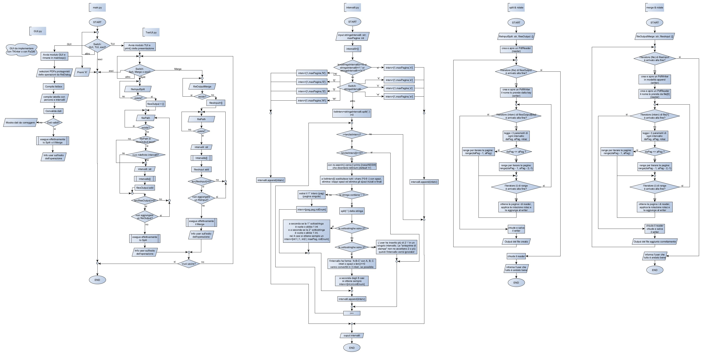

# RaMeS - Raffaele's Merge & Split - mini PDF editor

**Versione:** 0.1.0 (Alpha - Early Stage) 

**Autore:** Raffaele N.

## Descrizione

RaMeS è un'utility desktop scritta in Python nata per semplificare le operazioni di divisione (Split) e unione (Merge) di file PDF.

In questa fase iniziale, il progetto si concentra sulla logica di base per la manipolazione delle pagine e la gestione degli intervalli.

## Stato del Progetto (v0.1.0)

Questa versione rappresenta il primo prototipo funzionale del core logico.

- **Logica Intervalli:** Implementazione iniziale del parsing delle stringhe per definire quali pagine estrarre o unire.
- **Rotazione:** Supporto base a 4 angoli (0°, 90°, 180°, 270°) tramite l'enumeratore `Rotazione`.
- **Integrazione PDF:** Uso della libreria `pypdf` per le operazioni di basso livello.

## Contenuto del Repository

- `intervalli.py`: Gestione procedurale degli intervalli di pagine.
- `pdf_esempi.py`: Esempi di utilizzo della libreria pypdf per split, merge e rotazione pagine.
- `tests.py`: Test unitari per verificare la correttezza del parsing degli intervalli.
- `requirements.txt`: Elenco delle dipendenze necessarie.
- `.gitignore`: Configurazione per escludere file temporanei e note personali dal versionamento.

## Installazione

Assicurati di avere Python 3.x installato. Installa le dipendenze con:

`Bash`
```
pip install -r requirements.txt
```

## Limitazioni Note (Known Bugs)

- I Docstrings e i commenti sono attualmente in lingua italiana.
- Non è presente un sistema di validazione dei tipi a runtime (Type Hinting presente solo come suggerimento visivo).
- `pdf_esempi.py` non esegue controlli preventivi sulla validità o sulla sicurezza dei file PDF (es. file corrotti o protetti da password).
- Interfaccia utente (GUI/CLI) non ancora implementata; il software va eseguito tramite script di test.

## Prossime Implementazioni (Next Implementations)
- Traduzione di variabili, classi, enum e documentazione in **inglese**.
- Refactoring della logica degli intervalli in una classe dedicata (Interval).
- Estensione del sistema di rotazione per gestire angoli relativi e assoluti (nsew / NESW).
- Creazione di un modulo wrapper (pdf_engine) per la gestione sicura delle eccezioni di pypdf.
- Sviluppo dell'interfaccia a riga di comando (CLI) senza parametri.

## Note di Progettazione (v0.1.0)

- **Metodo di Sviluppo:** Il progetto segue un approccio **Bottom-Up** (dal basso verso l'alto). 
Si è partiti dalla realizzazione dei moduli atomici (gestione intervalli e manipolazione PDF) prima di 
prevedere l'integrazione di interfacce utente.
- **Architettura:** La struttura del software è pianificata seguendo rigorosamente il **Diagramma di Flusso** 
incluso nella cartella `docs/`.  Questo garantisce una coerenza 
logica tra l'idea iniziale e l'implementazione del codice.
- **Stile di Codifica:** Per facilitare un'eventuale conversione verso linguaggi **C-like** (C, C#, Java, ...) e 
migliorare la leggibilità dei blocchi indentati in Python, il codice utilizza commenti di chiusura espliciti 
(es. `# /if`, `# /while`, `# /merge`).

*Figura 1: Schema logico della gestione intervalli e flusso principale.*